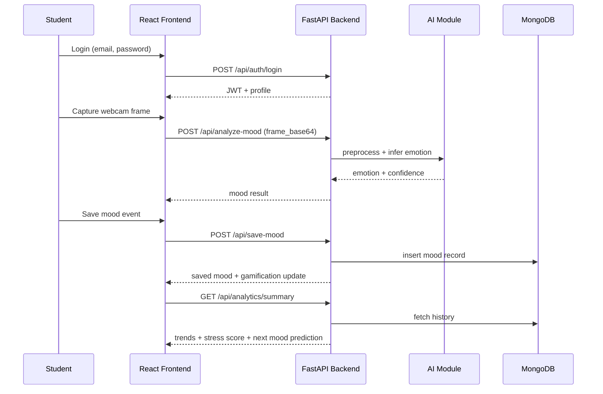

# API Sequence and Evaluation Demo

## Mood Check-In Sequence

## Suggested Final-Year Demo Script
1. Register a student account and login.
2. Run mood detection with webcam and show confidence output.
3. Save multiple mood entries and open history analytics.
4. Display personalized recommendations and stress score.
5. Use seeded admin account to call admin metrics endpoint.
6. Explain privacy model: no raw image storage, encrypted fields.
