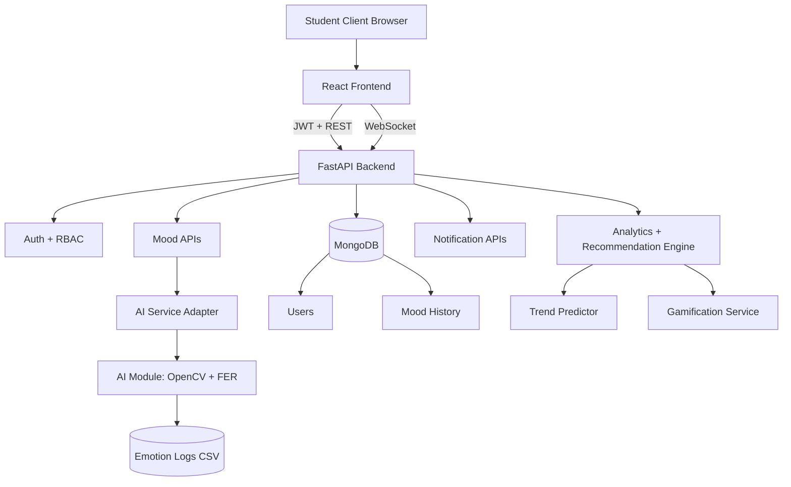

# PulseMind AI Architecture

## System Architecture Diagram

## Data Flow Summary
1. Student authenticates via JWT login.
2. Frontend captures webcam frame and sends base64 payload to /analyze-mood.
3. Backend runs AI inference, returns emotion + confidence.
4. Frontend confirms save and backend persists mood event to MongoDB.
5. Analytics and recommendation APIs process history to compute trends, stress score, and personalized actions.
6. WebSocket channel streams live mood updates to dashboard.

## Privacy and Security Controls
- Password hashing with bcrypt via passlib.
- JWT-based authentication and role checks.
- Sensitive profile fields encrypted before database storage.
- No raw webcam images stored in MongoDB.
- API rate limits to reduce abuse risk.
