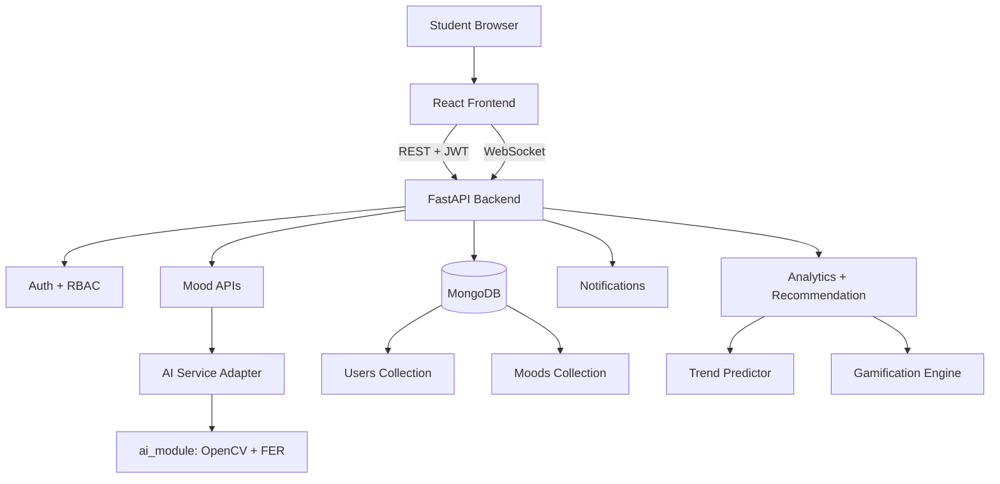
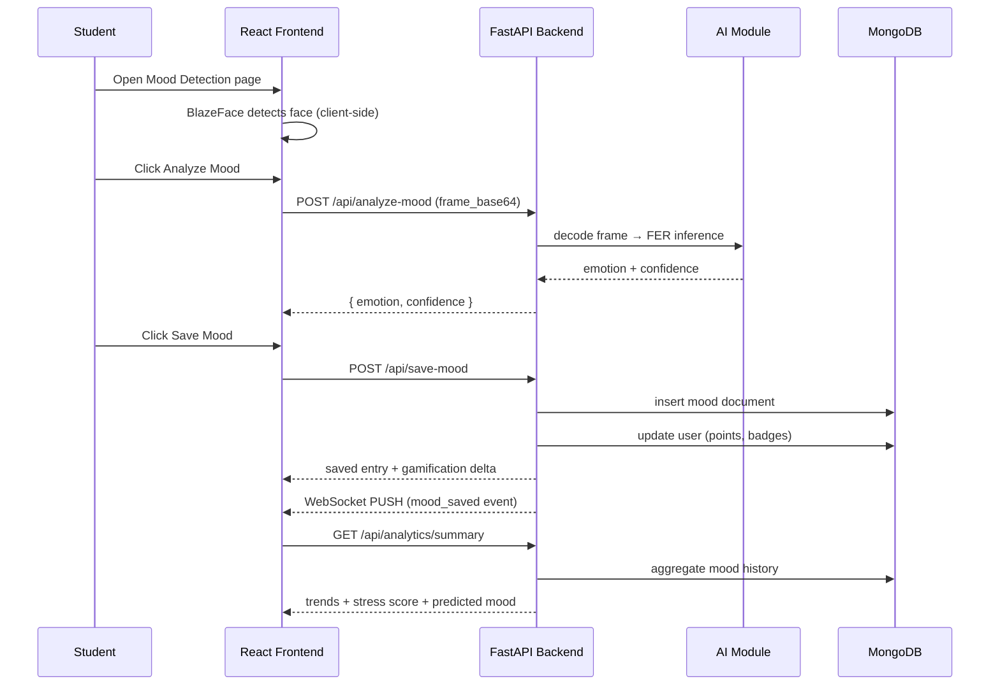

# PulseMind AI — Detailed Presentation
**AI-Driven Digital Mental Health and Psychological Support System for Higher Education Students**

> **Team:** Team Vijayas — Lovely Professional University  
> **Date:** April 2026  
> **Event:** Final-Year B.Tech Project Evaluation

---

## Slide 1 — Title

### PulseMind AI

*Intelligent, Gamified, Privacy-First Mental Wellness for University Students*

- AI-powered webcam mood detection
- Personalized recommendations grounded in CBT, ACT, and Resilience Theory
- Gamification for sustained daily engagement
- Full-stack prototype: React + FastAPI + MongoDB

---

## Slide 2 — The Problem We Are Solving

### Mental Health Crisis in Higher Education

> "20–31 % of higher-education students exhibit clinically significant mental health symptoms."  
> — Hyseni Duraku et al., 2023

**Key pain points:**

| Pain Point | Impact |
|---|---|
| Understaffed counselling services | Students wait weeks for support |
| Stigma around help-seeking | High-risk students go undetected |
| Passive, one-size-fits-all digital tools | Poor engagement, drop-off within days |
| Lack of data-driven early intervention | Counsellors cannot act proactively |

**The core gap:** Students need a low-friction, private, daily-use tool that adapts to their emotional state and encourages consistent engagement.

---

## Slide 3 — Our Solution

### PulseMind AI at a Glance

A full-stack, privacy-first mental wellness platform with seven integrated capabilities:

```
  ┌──────────────────────────────────────────────────────────┐
  │                     PULSEMIND AI                         │
  │  ┌─────────────┐  ┌───────────────┐  ┌───────────────┐  │
  │  │  AI Mood    │  │ Personalized  │  │  Psychology   │  │
  │  │ Detection   │  │Recommendations│  │  Analytics    │  │
  │  └─────────────┘  └───────────────┘  └───────────────┘  │
  │  ┌─────────────┐  ┌───────────────┐  ┌───────────────┐  │
  │  │Gamification │  │   Realtime    │  │  Role-Based   │  │
  │  │  (Points +  │  │ WebSocket     │  │  Admin &      │  │
  │  │   Badges)   │  │  Updates      │  │  Counsellor   │  │
  │  └─────────────┘  └───────────────┘  └───────────────┘  │
  │           Privacy-First · GDPR-Aligned · JWT Auth         │
  └──────────────────────────────────────────────────────────┘
```

**Immediate value:** A student opens the app, takes a 2-second mood scan, and gets a personalized action plan — in under 30 seconds.

---

## Slide 4 — System Architecture

### Three-Layer Architecture

```
┌─────────────────────────────────────────────────────────┐
│                      CLIENT LAYER                        │
│   React 18 + Vite SPA (Tailwind, Zustand, Axios)         │
│   BlazeFace (In-Browser Face Detection via TensorFlow.js)│
│   WebSocket Client (per-user live channel)               │
└────────────────────────┬────────────────────────────────┘
                         │  HTTPS / WSS
┌────────────────────────▼────────────────────────────────┐
│                    API GATEWAY LAYER                     │
│   FastAPI (Python 3.11) · Uvicorn ASGI                   │
│   Routers: auth | mood | recommend | analytics |         │
│            notifications | websocket                     │
│   Middleware: CORS · JWT Auth · SlowAPI Rate Limiter     │
└──────┬───────────────┬──────────────────┬───────────────┘
       │               │                  │
┌──────▼──────┐ ┌──────▼──────┐ ┌────────▼──────────────┐
│  AI MODULE  │ │  SERVICES   │ │    DATA LAYER          │
│  detector.py│ │ gamification│ │  MongoDB 7.0           │
│  FER + CV2  │ │ analytics   │ │  Collections:          │
│  trend_pred │ │ recommend   │ │   - users              │
│  emotion_log│ │ websocket   │ │   - moods              │
└─────────────┘ └─────────────┘ └────────────────────────┘
```

**Mermaid Version:**



---

## Slide 5 — Technology Stack

### Complete Technology Inventory

| Layer | Technology | Version | Purpose |
|---|---|---|---|
| Frontend Framework | React | 18.x | SPA component model |
| Build Tool | Vite | 5.x | Fast HMR, optimised builds |
| Styling | Tailwind CSS | 3.x | Utility-first styling |
| State | Zustand | 4.x | Lightweight global state |
| HTTP Client | Axios | 1.x | API calls with auth interceptor |
| Charts | Recharts + Chart.js | 2.x | Mood trend visualisation |
| Animation | Framer Motion | 11.x | Page transitions, micro-interactions |
| 3D Graphics | Three.js | r164 | Neural hero component |
| In-Browser Face | TF.js + BlazeFace | 0.1.x | Client-side face localisation |
| Backend Framework | FastAPI | 0.115.x | Async Python REST API |
| ASGI Server | Uvicorn | 0.32.x | FastAPI production runtime |
| Database | MongoDB | 7.0 | Document-store persistence |
| ODM | Motor | 3.6.x | Async MongoDB driver |
| Auth | python-jose | 3.3.x | JWT creation and validation |
| Passwords | passlib[bcrypt] | 1.7.x | Bcrypt hashing |
| Encryption | cryptography (Fernet) | 43.x | Symmetric field-level encryption |
| Rate Limiting | SlowAPI | 0.1.9 | Per-IP rate guards |
| Emotion AI | FER | 22.5.x | Deep-learning emotion classifier |
| Computer Vision | OpenCV | 4.10.x | Frame preprocessing + cascades |
| ML Baseline | scikit-learn / numpy | 1.5.x | Logistic regression recommender |
| Containerisation | Docker + Compose | 25.x | Local orchestration |
| CI/CD | GitHub Actions | — | Automated tests + API smoke |
| Testing | pytest | 8.3.x | Backend unit + integration tests |

---

## Slide 6 — Feature Deep-Dive: AI Mood Detection

### How Emotion Analysis Works — Step by Step

```
  Browser                Backend              AI Module
  ──────                 ───────              ─────────
  1. Webcam frame
     captured in React
  2. BlazeFace checks
     for a face client-
     side (privacy: no
     face leaves browser
     unless detected)
  3. Frame → base64
     string sent to:
                  POST /api/analyze-mood
                         │
                  4. CV2 decodes frame
                  5. AI Module called:
                             │
                     6. FER pipeline:
                        - Haar cascade
                          detects face
                        - CNN classifies
                          7 raw emotions
                        - Grouped →
                          Happy/Neutral/Sad
                        - Confidence scored
                             │
                     7. Fallback if FER
                        unavailable:
                        brightness heuristic
                  8. Emotion + confidence
                     returned to frontend
  9. User reviews
     result → clicks
     Save Mood
```

**Emotions detected:** `Happy`, `Neutral`, `Sad`  
**Confidence range:** `0.0 – 1.0`  
**Privacy guarantee:** Raw frames are **never stored**. Only `emotion` + `confidence` + `timestamp` are persisted.

**Debug endpoint** (`POST /api/analyze-mood-debug`) additionally returns:
- detection method (`fer` or `brightness_fallback`)
- grouped raw scores per category
- `fer_available` flag

---

## Slide 7 — Feature Deep-Dive: Mood Save and Gamification

### What Happens When a User Saves a Mood Entry

```
POST /api/save-mood
   │
   ├─ Normalize emotion label
   ├─ Map to mood score (Happy=2, Neutral=1, Sad=0)
   ├─ Insert mood document into MongoDB
   │       { user_id, emotion, confidence,
   │         mood_score, source, created_at }
   │
   ├─ GAMIFICATION ENGINE
   │    award_points(current_points, confidence)
   │      → +5 base + confidence bonus (up to +5)
   │
   │    update_badges(badges, all_emotions, total_logs)
   │      → "Consistency Starter"   if total_logs ≥ 7
   │      → "Mindful Momentum"      if total_logs ≥ 30
   │      → "Positive Spark"        if Happy count ≥ 10
   │
   ├─ Update user document (points + badges) in MongoDB
   │
   └─ WebSocket PUSH (if client connected)
         { type: "mood_saved", emotion, points, badges }
```

**Achievements Page:** Displays current points tally, unlocked badges, and progress towards next milestone.

---

## Slide 8 — Feature Deep-Dive: Analytics Dashboard

### Understanding Emotional Trends Over Time

**What the analytics pipeline computes:**

```
GET /api/analytics/summary
   │
   ├─ Fetch up to 1,000 mood records for authenticated user
   │
   ├─ Group by week  → weekly emotion distribution
   ├─ Group by month → monthly emotion distribution
   │
   ├─ Stress Score calculation
   │     weighted sum: Sad × 2 + Neutral × 1 + Happy × 0
   │     normalised to 0–100 scale
   │
   ├─ Predict next mood
   │     Logistic regression on last 3 mood scores + avg confidence
   │     Returns: "Happy" | "Neutral" | "Sad"
   │
   └─ Response includes:
         stress_score, weekly[], monthly[], predicted_next_mood
```

**UI Components:**
- **Dashboard Page** — stress score card, predicted next mood card, points card, live WebSocket badge indicator, trend line chart
- **History & Analytics Page** — monthly confidence chart (Chart.js), recent mood table with timestamps

---

## Slide 9 — Feature Deep-Dive: Recommendation Engine

### Personalized Interventions for Each Emotional State

```
GET /api/recommend
   │
   ├─ Fetch 20 most recent mood records
   ├─ Extract emotion list + average confidence
   │
   ├─ TREND PREDICTOR
   │     LogisticRegression.predict([score_n-2, score_n-1, score_n, avg_conf])
   │     → predicted_next_mood
   │
   ├─ RECOMMENDATION ENGINE
   │     Identify dominant mood from Counter(emotions)
   │     Select matching recommendation template:
   │
   │     Happy  → { peer study group, gratitude walk, mentor junior }
   │     Neutral→ { stretching, plan tomorrow's tasks, social activity }
   │     Sad    → { sunlight break, contact trusted friend, counselling resources }
   │
   │     + journaling_prompt (mood-adaptive)
   │     + breathing_exercise
   │     + challenge (micro-action)
   │
   └─ Returns:
         activities[], journaling_prompt, breathing_exercise,
         challenge, predicted_next_mood, stress_score
```

**Therapeutic frameworks applied:** CBT (cognitive reframing prompts), ACT (acceptance-based challenges), Resilience Theory (strengths-based micro-actions).

---

## Slide 10 — Feature Deep-Dive: Security and Privacy

### Privacy-First Design — No Raw Biometric Data Stored

```
WHAT WE STORE                    WHAT WE NEVER STORE
─────────────                    ───────────────────
emotion label (string)           raw webcam frames
confidence score (float)         facial images or embeddings
timestamp                        raw facial coordinates
user_id (opaque ObjectId)        identifiable biometrics

USER PROFILE SECURITY
─────────────────────
email           → stored in plaintext (lookup key)
full_name       → Fernet-encrypted before storage
password        → bcrypt-hashed (never reversed)

API SECURITY
────────────
All endpoints except /register and /login require JWT Bearer token
JWTs include: subject (email), role, expiry
Admin endpoints guarded by require_role({"admin"}) dependency
Rate limits: 5/minute (auth), 60/minute (API)
CORS restricted to configured frontend origin
```

**Data minimisation:** The system captures the minimum data needed to power analytics — emotion label and confidence only.

---

## Slide 11 — Data Models

### MongoDB Document Schema

#### User Document

```json
{
  "_id":                  "ObjectId",
  "email":                "student@university.edu",
  "full_name":            "<Fernet-encrypted>",
  "hashed_password":      "$2b$12$...",
  "role":                 "student | counsellor | admin",
  "points":               42,
  "badges":               ["Consistency Starter", "Positive Spark"],
  "notification_enabled": true,
  "reminder_hour":        20,
  "created_at":           "2026-04-21T10:00:00Z"
}
```

#### Mood Document

```json
{
  "_id":         "ObjectId",
  "user_id":     "ObjectId (ref: users)",
  "emotion":     "Happy | Neutral | Sad",
  "confidence":  0.847,
  "mood_score":  2,
  "source":      "webcam | api-smoke | ci-smoke",
  "created_at":  "2026-04-21T14:32:00Z"
}
```

---

## Slide 12 — Complete API Reference

### All Endpoints at a Glance

#### System (No Auth)

| Method | Endpoint | Description |
|---|---|---|
| GET | `/` | Service message |
| GET | `/health` | Liveness probe |
| GET | `/ready` | Readiness probe (DB ping) |

#### Authentication

| Method | Endpoint | Auth | Description |
|---|---|---|---|
| POST | `/api/auth/register` | None | Register new student account |
| POST | `/api/auth/login` | None | Login, returns JWT + profile |
| GET | `/api/auth/me` | JWT | Authenticated user profile |

#### Mood

| Method | Endpoint | Auth | Description |
|---|---|---|---|
| POST | `/api/analyze-mood` | JWT | Analyse emotion from base64 frame |
| POST | `/api/analyze-mood-debug` | JWT | Debug with method + grouped scores |
| POST | `/api/save-mood` | JWT | Save mood entry + gamification update |
| GET | `/api/get-history?limit=50` | JWT | Recent mood history |

#### Recommendations

| Method | Endpoint | Auth | Description |
|---|---|---|---|
| GET | `/api/recommend` | JWT | Personalized recommendation payload |

#### Analytics

| Method | Endpoint | Auth | Description |
|---|---|---|---|
| GET | `/api/analytics/summary` | JWT | Weekly/monthly trends + stress score |
| GET | `/api/analytics/admin/user-metrics` | JWT (admin) | Aggregate platform metrics |

#### Notifications

| Method | Endpoint | Auth | Description |
|---|---|---|---|
| POST | `/api/notifications/preferences` | JWT | Set reminder hour and enable/disable |
| GET | `/api/notifications/daily-check` | JWT | Daily reminder payload |

#### Realtime

| Method | Endpoint | Description |
|---|---|---|
| WS | `/api/ws/mood/{user_id}` | Per-user live event channel |

**Interactive Swagger UI:** `http://localhost:8000/docs`

---

## Slide 13 — API Sequence Diagram

### Core Mood Check-In Flow



---

## Slide 14 — Deployment Architecture

### Local Development (Recommended)

```yaml
# docker-compose.yml services
mongo:
  image: mongo:7
  volumes: [mongo_data:/data/db]   # Persistent named volume
  ports: [27017:27017]

backend:
  build: ./backend
  env_file: ./backend/.env
  ports: [8000:8000]
  depends_on: [mongo]

frontend:
  build: ./frontend
  env_file: ./frontend/.env
  ports: [5173:5173]
  depends_on: [backend]
```

**One command start:**
```bash
docker compose up --build
```

**Access:**
- Frontend: `http://localhost:5173`
- Backend (Swagger): `http://localhost:8000/docs`

### Environment Variables Summary

| Variable | Layer | Importance |
|---|---|---|
| `SECRET_KEY` | Backend | JWT signing — **must be rotated for production** |
| `ENCRYPTION_KEY` | Backend | Fernet key for profile field encryption |
| `MONGODB_URI` | Backend | Connection string |
| `CORS_ORIGINS` | Backend | Allowed frontend origins |
| `VITE_API_BASE_URL` | Frontend | Backend REST base URL |
| `VITE_WS_BASE_URL` | Frontend | Backend WebSocket base URL |

---

## Slide 15 — CI/CD Pipeline

### Automated Quality Gates on Every Push

```
GitHub Push / Pull Request to main
              │
              ▼
   ┌──────────────────────┐
   │  Job 1: backend-tests │
   │  ─────────────────── │
   │  • Setup Python 3.11  │
   │  • pip install -r     │
   │    requirements.txt   │
   │  • pytest -q          │
   │  ✓ 2 tests pass       │
   └──────────┬───────────┘
              │ needs: backend-tests
              ▼
   ┌──────────────────────┐
   │  Job 2: api-smoke    │
   │  ─────────────────── │
   │  • Start MongoDB      │
   │    service container  │
   │  • Start FastAPI      │
   │    (uvicorn, nohup)   │
   │  • Wait for /health   │
   │  • python scripts/    │
   │    ci_api_smoke.py    │
   │                       │
   │  Validates:           │
   │  ✓ health + ready     │
   │  ✓ register + login   │
   │  ✓ analyze-mood       │
   │  ✓ save-mood          │
   │  ✓ get-history        │
   │  ✓ recommend          │
   │  ✓ analytics/summary  │
   │  ✓ notifications      │
   └──────────────────────┘
```

**Workflow file:** `.github/workflows/ci.yml`  
**Smoke script:** `scripts/ci_api_smoke.py`  
**Documentation:** `docs/ci_pipeline.md`

---

## Slide 16 — Frontend Application Pages

### What Each Page Does

| Page | Route | Key Features |
|---|---|---|
| Auth | `/auth` | Register / Login forms with JWT handling and error display |
| Dashboard | `/dashboard` | Stress score, predicted next mood, points, trend chart, WebSocket live badge |
| Mood Detection | `/mood` | Webcam feed, BlazeFace face detection indicator, Analyze and Save buttons |
| History & Analytics | `/analytics` | Monthly confidence chart, sortable history table |
| Recommendations | `/recommendations` | Activities, journaling prompt, breathing exercise, challenge, stress score |
| Achievements | `/achievements` | Badge gallery, point total, milestone progress |

**Design System — Neural Glass:**
- **Background:** Deep dark (`#050714`) with layered depth
- **Cards:** Glassmorphism (frosted translucent panels with glow borders)
- **Colour accent:** Neural Electric Cyan (`#00aaff`) + Pulse Violet (`#6600ff`)
- **Motion:** Framer Motion transitions on all route changes and card mounts
- **3D:** Three.js neural network hero on dashboard

---

## Slide 17 — Live Demo Flow (7 Minutes)

### Pre-Demo Checklist (10 minutes before)

- [ ] Docker Desktop is running
- [ ] PowerShell at project root
- [ ] Webcam permissions enabled in browser
- [ ] Run pre-flight validation:
  ```powershell
  ./scripts/presentation_prep.ps1
  ```

---

### Demo Step 1 — Start System (30 sec)

```powershell
./scripts/start_local_demo.ps1
```

**Say:** "One command starts MongoDB, the FastAPI backend, and the React frontend. The platform uses a modular, microservice-style architecture: client layer, API layer, AI module, and data layer."

---

### Demo Step 2 — Prove Operational Readiness (20 sec)

```powershell
Invoke-RestMethod http://localhost:8000/health
Invoke-RestMethod http://localhost:8000/ready
```

**Say:** "Health confirms the service is running. Ready confirms live database connectivity. Both are used by our CI pipeline as liveness and readiness probes."

---

### Demo Step 3 — Register + Login + Dashboard (60 sec)

Open: `http://localhost:5173`

1. Register a new student account
2. Log in — observe JWT issued and stored
3. Show dashboard: stress score card, predicted next mood, points, trend chart

**Say:** "JWT-based authentication secures every session. The dashboard gives the student an instant emotional summary — stress score, predicted next mood, and cumulative points."

---

### Demo Step 4 — AI Mood Detection (90 sec)

Navigate to Mood Detection page.

1. Position face in webcam view — BlazeFace detects face client-side
2. Click **Analyze Mood** — frame sent to `/api/analyze-mood`
3. Show returned emotion label and confidence score
4. Click **Save Mood** — gamification update fires

**Say:** "The frame goes from browser to our OpenCV + FER pipeline in the backend. The key privacy guarantee: we only store the emotion label and confidence score. No images. No biometrics."

---

### Demo Step 5 — Analytics + Recommendations (90 sec)

1. Open History & Analytics — show confidence chart, history table
2. Open Recommendations — show tailored activities, journaling prompt, breathing exercise
3. Note: predicted next mood and stress score visible

**Say:** "The recommendation engine uses a logistic regression model trained on the student's recent mood history. Recommendations are grounded in CBT and Resilience Theory — not generic advice."

---

### Demo Step 6 — API Automation Proof (45 sec)

```powershell
./scripts/demo_api_flow.ps1
```

**Say:** "This script exercises the entire API surface end-to-end: register, login, analyze, save, history, recommend, analytics, and notifications. This is reproducible, deterministic proof of engineering quality."

---

### Demo Step 7 — RBAC + Admin (45 sec)

```powershell
cd backend
python -m scripts.seed_admin `
  --email admin@university.edu `
  --full-name "System Admin" `
  --password "AdminPass123!"
cd ..
```

**Say:** "Role-based access control is enforced at the dependency layer in FastAPI. The admin metrics endpoint is unreachable by student tokens — this protects aggregate institutional data."

---

### Demo Step 8 — Engineering Quality (30 sec)

**Say:** "Our GitHub Actions CI pipeline runs on every push: backend unit tests followed by a full API smoke flow against a live MongoDB container. Docs cover architecture, API sequences, and CI — all present in the `docs/` directory."

---

### Demo Step 9 — Shutdown (15 sec)

```powershell
./scripts/stop_local_demo.ps1
```

**Fallback plan if webcam fails:**
1. Run `./scripts/demo_api_flow.ps1` to prove full backend + AI flow
2. Show existing mood history and analytics from seeded data
3. Walk through architecture doc to explain privacy and security decisions

---

## Slide 18 — Evaluation Framework

### Psychological Evaluation

| Tool | What It Measures | Target |
|---|---|---|
| **DASS-21** | Depression, Anxiety, Stress Scale (21 items) | ≥ 20 % stress reduction pre/post |
| **BRS** | Brief Resilience Scale (6 items) | ≥ 15 % resilience improvement |
| **SUS** | System Usability Scale (10 items) | ≥ 80 / 100 |
| **NPS** | Net Promoter Score | ≥ +40 |

### Technical Excellence Metrics

| Metric | Target |
|---|---|
| API P95 latency (non-AI endpoints) | < 500 ms |
| Emotion analysis P95 | < 2 s |
| System availability (dev/demo) | ≥ 99 % |
| Backend unit test coverage | ≥ 70 % |
| Auth security vulnerabilities | 0 critical |

### Pilot Study Design

- **Participants:** 150 university students, aged 18–25
- **Duration:** 6 weeks
- **Session:** 10–15 minutes per day
- **Statistical approach:** Pre/post comparison with paired t-tests and ANOVA
- **Ethics:** IRB-approved protocol, GDPR-compliant, informed consent required, high-risk cases flagged to counsellor

---

## Slide 19 — User Stories (Key Examples)

### Student

| ID | As a Student I want to… | So that… |
|---|---|---|
| US-01 | Register with my university email | I have a private, secure account |
| US-02 | Analyze my mood via webcam | I get instant, objective emotional feedback |
| US-03 | Save my mood entry | I can track emotional patterns over time |
| US-04 | View my mood history chart | I see weekly and monthly trends |
| US-05 | Receive AI recommendations | I get personalized, actionable coping suggestions |
| US-06 | Earn points and badges | I stay motivated to check in daily |

### Counsellor

| ID | As a Counsellor I want to… | So that… |
|---|---|---|
| US-11 | View aggregate stress trends | I identify at-risk cohorts proactively |
| US-12 | Receive high-stress alerts | I can intervene before a student reaches crisis |

### Admin

| ID | As an Admin I want to… | So that… |
|---|---|---|
| US-14 | View user metrics dashboard | I monitor platform adoption and health |

---

## Slide 20 — Risks and Mitigations

| Risk | Severity | Mitigation |
|---|---|---|
| FER unavailable in deployment env | High | Brightness-based fallback always active; gracefully degraded confidence reported |
| Default `SECRET_KEY` in production | **Critical** | Env-var injection at runtime; documented in deployment guide and README |
| WebSocket auth bypass | High | Route-level auth middleware; user_id binding validated on connect |
| Low test coverage | Medium | Current: 2 unit tests passing; target ≥ 70 % with expanded pytest fixtures |
| Recommendation model drift | Medium | Predictions logged; confidence threshold alerts planned for v2 |
| Student privacy breach | **Critical** | Fernet encryption at rest, GDPR-aligned data minimisation, no raw images stored |
| Single-point MongoDB failure | Medium | Docker named volume for data persistence; replica set config documented for scale |

---

## Slide 21 — What Is Strong vs What Is Baseline

### Engineering Strengths

- ✅ End-to-end product flow fully implemented and coherent
- ✅ Security fundamentals: JWT, bcrypt, Fernet encryption, RBAC, rate limiting
- ✅ Privacy-by-design: no raw image storage, encrypted profile fields
- ✅ Real-time capability via WebSocket manager
- ✅ Comprehensive demo and automation scripts
- ✅ CI pipeline with unit tests and full API smoke validation
- ✅ Rich documentation: architecture, API sequence, runbook, presentation scripts

### Areas Marked as Baseline / Partial

| Area | Current State | Target for Production |
|---|---|---|
| Recommendation model | Logistic regression with synthetic seed data | Fine-tuned on real anonymised user cohort |
| Emotion confidence | FER/heuristic, not clinically calibrated | Calibrated + validated against labelled dataset |
| Notification delivery | API preference/payload only | Full scheduler + push/email channels |
| WebSocket auth | Connection-level, not message-level auth | Per-message token validation |
| Test coverage | 2 unit tests | ≥ 70 % backend coverage |

---

## Slide 22 — Roadmap and Future Enhancements

### Phase 2 — Near Term

- [ ] Wearable data integration (heart rate, sleep patterns) for richer mood context
- [ ] Multilingual recommendation content (Hindi, Tamil, Telugu — aligned to LPU student demographics)
- [ ] Full notification delivery: email via SMTP, browser push via Service Worker
- [ ] Expanded test coverage to ≥ 70 % with integration tests against mongomock-motor

### Phase 3 — Medium Term

- [ ] Therapeutic mini-games: mindfulness breathing, memory puzzle, creative sandbox (CBT / ACT tagged)
- [ ] Peer community layer: anonymous moderated forum with counsellor alerts
- [ ] Institutional SSO via OAuth 2.0 (hook already present in architecture)
- [ ] GDPR self-service: user-initiated data export and account deletion

### Phase 4 — Research Grade

- [ ] Privacy-preserving federated learning for cross-institution model improvement
- [ ] Longitudinal efficacy study (semester-length, IRB-approved)
- [ ] Native mobile apps (iOS / Android via React Native)
- [ ] Integration with university counselling triage workflows

---

## Slide 23 — Out of Scope (This Version)

The following were intentionally deferred:

- Native mobile application (iOS / Android)
- Biometric wearable integration (heart rate, sleep data)
- Multilingual support
- Full Unity/Phaser therapeutic game engine
- Long-term longitudinal study
- Production-grade observability (structured logs, metrics, distributed tracing)

---

## Slide 24 — Glossary

| Term | Definition |
|---|---|
| **FER** | Facial Expression Recognition — deep learning model for emotion inference |
| **CBT** | Cognitive Behavioural Therapy |
| **ACT** | Acceptance and Commitment Therapy |
| **DASS-21** | Depression Anxiety Stress Scale — 21-item validated questionnaire |
| **BRS** | Brief Resilience Scale |
| **SUS** | System Usability Scale |
| **JWT** | JSON Web Token — stateless, signed authentication mechanism |
| **Fernet** | Symmetric authenticated encryption from the Python `cryptography` library |
| **BlazeFace** | Lightweight in-browser face detector (TensorFlow.js) |
| **SlowAPI** | FastAPI-compatible rate-limiting library |
| **RBAC** | Role-Based Access Control |
| **GDPR** | General Data Protection Regulation |
| **NPS** | Net Promoter Score |
| **IRB** | Institutional Review Board |

---

## Slide 25 — Conclusion

### PulseMind AI — Summary

> A working, demo-ready, privacy-first mental wellness platform designed for the daily reality of university students.

**What we built:**
- Full-stack prototype: React + FastAPI + MongoDB
- AI-powered webcam mood detection with graceful fallback
- Personalized recommendations grounded in clinical frameworks
- Gamification to sustain long-term engagement
- Privacy-first: no biometrics stored, fields encrypted, rate-limited
- Automated CI and comprehensive documentation

**Academic achievement level:**
- Advanced final-year prototype — technically coherent, demo-ready, and well-structured
- Security fundamentals are production-appropriate for a prototype
- Recommended path to production: expand test coverage, harden WebSocket auth, add observability, and run a proper IRB-approved pilot study

---

**Thank you. Questions welcome.**

---

## Supporting References

| Document | Purpose |
|---|---|
| `docs/architecture.md` | System architecture narrative + Mermaid diagram |
| `docs/api_sequence.md` | API interaction sequence diagrams |
| `docs/ci_pipeline.md` | CI/CD pipeline documentation |
| `docs/next_step_runbook.md` | Operational runbook for demo day |
| `docs/comprehensive_project_report_2026-04-21.md` | Full implementation status report |
| `README.md` | Complete setup, API reference, and operations guide |
| `prd.md` | Product requirements document |
| `tech.md` | Technical specification |
| `design.md` | UI/UX design specification |
